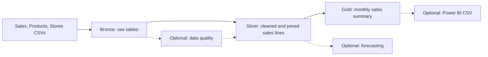

# Data Guide: From CSV to Gold

This guide explains what the retail files contain, how each pipeline layer
changes them, and what the final numbers mean. It also serves as the project's
data dictionary. You can read it on GitHub as a formatted page. In VS Code,
open this file and press **Ctrl+Shift+V** for the formatted preview.

The project asks: **How do sales and estimated gross profit change by month,
product category, and sales channel?** It uses three CSV files from the
[Global Electronics Retailer dataset](https://mavenanalytics.io/data-playground/global-electronics-retailer).
The data is fictional. The other supplied files are not needed for this
question.

## Follow the data



Solid arrows show the core pipeline. Dotted arrows are optional exercises.
Pandas reads the CSVs, cleans and joins Bronze data into Silver, then groups
Silver data into Gold. DuckDB stores the Bronze, Silver, and Gold tables in one
local file. The data-quality route is optional; the core pipeline runs directly
from Bronze to Silver.

## Source files

| File | What one row represents | How the project uses it |
|---|---|---|
| `Sales.csv` | One product line within an order | Main transaction input; 62,884 rows in the bundled file |
| `Products.csv` | One product | Supplies names, categories, standard USD price and cost; 2,517 rows |
| `Stores.csv` | One physical or online store | Supplies store location; key `0` is online; 67 rows |

The files are in [`step_01_data/`](../step_01_data/). The supplied
[`Data_Dictionary.csv`](../step_01_data/Data_Dictionary.csv) describes the
original source headers. This guide also documents the fields **after** the
pipeline renames, cleans, and adds them. `Customers.csv` and
`Exchange_Rates.csv` are supplied in `step_01_data/optional/` but are not
loaded by the core pipeline.

## What changes in each layer

- **Bronze** stores source-shaped data. Dates, quantities, and prices stay as
  text so they can be compared with the CSVs. It adds a load timestamp and
  source filename.
- **Silver** converts dates and numbers, joins each sales line to one product
  and one store, labels the sales channel, and calculates line-level measures.
  It still has one row per sales line.
- **Gold** groups Silver lines by order month, product category, and sales
  channel. One row now represents one combination of those three dimensions.

CSV headers use spaces and mixed case; DuckDB columns use `snake_case`. Bronze,
Silver, and Gold are schemas within the same local DuckDB database.

## Grain and Keys

| Table | One row represents | Key |
|---|---|---|
| `bronze.sales` | One product line within an order | `(order_number, line_item)` |
| `bronze.products` | One product | `product_key` |
| `bronze.stores` | One physical or online store | `store_key` |
| `silver.sales_enriched` | One cleaned and enriched sales line | `(order_number, line_item)` |
| `gold.monthly_sales_summary` | One month, category, and channel combination | `(sales_month, product_category, sales_channel)` |

## Source and Bronze Dictionary

Bronze keeps the source fields recognizable. Source values, including dates and
numbers, are loaded as text so pandas can handle their types in Silver.

### `bronze.sales`

| Column | Source header | Meaning |
|---|---|---|
| `order_number` | `Order Number` | Order identifier |
| `line_item` | `Line Item` | Product-line identifier within the order |
| `order_date` | `Order Date` | Date the order was placed |
| `delivery_date` | `Delivery Date` | Delivery date; blank is valid for in-store sales |
| `customer_key` | `CustomerKey` | Customer identifier retained for future extensions |
| `store_key` | `StoreKey` | Store identifier; `0` means online |
| `product_key` | `ProductKey` | Purchased product identifier |
| `quantity` | `Quantity` | Number of units purchased |
| `currency_code` | `Currency Code` | Currency used to process the order |
| `loaded_at` | generated | Timestamp for the pipeline load |
| `source_file` | generated | Name of the source CSV |

### `bronze.products`

| Column | Source header | Meaning |
|---|---|---|
| `product_key` | `ProductKey` | Product identifier |
| `product_name` | `Product Name` | Product description |
| `brand` | `Brand` | Product brand |
| `color` | `Color` | Product color |
| `unit_cost_usd` | `Unit Cost USD` | Unit cost stored as source text in Bronze |
| `unit_price_usd` | `Unit Price USD` | Unit price stored as source text in Bronze |
| `subcategory_key` | `SubcategoryKey` | Product subcategory identifier |
| `subcategory` | `Subcategory` | Product subcategory name |
| `category_key` | `CategoryKey` | Product category identifier |
| `category` | `Category` | Product category name |
| `loaded_at` | generated | Timestamp for the pipeline load |
| `source_file` | generated | Name of the source CSV |

### `bronze.stores`

| Column | Source header | Meaning |
|---|---|---|
| `store_key` | `StoreKey` | Store identifier |
| `country` | `Country` | Store country |
| `state` | `State` | Store state or region |
| `square_meters` | `Square Meters` | Store area; blank is valid for the online store |
| `open_date` | `Open Date` | Date the store opened |
| `loaded_at` | generated | Timestamp for the pipeline load |
| `source_file` | generated | Name of the source CSV |

## Silver Dictionary

### `silver.sales_enriched`

All columns below are typed and analytics-ready.

| Column | Type | Rule |
|---|---|---|
| `order_number` | `integer` | From sales |
| `line_item` | `integer` | From sales |
| `order_date` | `date` | Parse the source order date |
| `delivery_date` | `date` | Parse when present; otherwise `NULL` |
| `customer_key` | `integer` | From sales; no customer join in Project #1 |
| `store_key` | `integer` | From sales |
| `product_key` | `integer` | From sales |
| `quantity` | `integer` | Must be greater than zero |
| `currency_code` | `varchar` | Retained as source context |
| `product_name` | `text` | From products |
| `brand` | `text` | From products |
| `product_subcategory` | `text` | From products |
| `product_category` | `text` | From products |
| `unit_cost_usd` | `numeric(12,2)` | Pandas removes `$`, commas, and whitespace and calculates with decimal values |
| `unit_price_usd` | `numeric(12,2)` | Pandas removes `$`, commas, and whitespace and calculates with decimal values |
| `store_country` | `text` | From stores |
| `store_state` | `text` | From stores |
| `sales_channel` | `text` | `Online` for store `0`, otherwise `In Store` |
| `gross_sales_usd` | `numeric(14,2)` | `quantity * unit_price_usd` |
| `estimated_gross_profit_usd` | `numeric(14,2)` | `quantity * (unit_price_usd - unit_cost_usd)` |
| `loaded_at` | `timestamp with time zone` | Timestamp for the transformation run |

## Gold Dictionary

### `gold.monthly_sales_summary`

| Column | Type | Rule |
|---|---|---|
| `sales_month` | `date` | First day of the order month |
| `product_category` | `text` | Grouping from Silver |
| `sales_channel` | `text` | `Online` or `In Store` |
| `line_item_count` | `bigint` | Count of sales lines |
| `units_sold` | `bigint` | Sum of quantity |
| `gross_sales_usd` | `numeric(16,2)` | Sum of Silver gross sales |
| `estimated_gross_profit_usd` | `numeric(16,2)` | Sum of Silver estimated gross profit |

The bundled data produces 979 Gold rows. Each row answers one slice of the
project question, rather than representing a single order.

### Trace the Gold fields back to the CSVs

| Gold field | Starts with | What happens |
|---|---|---|
| `sales_month` | `Sales.csv` → `Order Date` | Silver parses the date; Gold uses its month |
| `product_category` | `Products.csv` → `Category` | Silver joins products to sales |
| `sales_channel` | `Sales.csv` → `StoreKey` | Silver labels key `0` Online and other keys In Store |
| `line_item_count` | `Sales.csv` → sales lines | Gold counts lines in each group |
| `units_sold` | `Sales.csv` → `Quantity` | Gold sums units in each group |
| `gross_sales_usd` | `Sales.csv` → `Quantity`; `Products.csv` → `Unit Price USD` | Silver multiplies; Gold sums |
| `estimated_gross_profit_usd` | `Sales.csv` → `Quantity`; `Products.csv` → `Unit Price USD`, `Unit Cost USD` | Silver calculates an estimate; Gold sums |

## Join Rules

```text
bronze.sales.product_key = bronze.products.product_key
bronze.sales.store_key   = bronze.stores.store_key
```

Both are many-to-one joins. The Silver row count must therefore match the Bronze
sales row count. The pipeline rejects a missing or duplicate product or store
key instead of silently dropping or multiplying transactions.

## What the measures mean

For each Silver sales line, pandas calculates:

```text
gross_sales_usd = quantity × unit_price_usd
estimated_gross_profit_usd = quantity × (unit_price_usd - unit_cost_usd)
```

For example, two units with a standard price of $20 and cost of $12 would
contribute $40 of gross sales and $16 of estimated gross profit. This is an
illustration, not a row copied from the dataset. Gold sums those line-level
values within each month, category, and channel. `line_item_count` counts
sales lines; `units_sold` sums their quantities, so the two measures need not
be equal.

The source's `Currency Code` describes how an order was processed. The
calculation above uses the product file's USD price and cost; it does not
convert a transaction amount using exchange rates. "Estimated gross profit"
is not accounting profit because the data has no transaction-level discounts,
taxes, refunds, or final accounting costs.

## Explore the results

After running a layer, open `support/viewer.py` in VS Code and click **Run
Python File**. The [Bronze](../step_02_bronze/README.md),
[Silver](../step_03_silver/README.md), and
[Gold](../step_04_gold/README.md) guides each provide a query to try. Stop
the viewer before running another pipeline layer so the database is not locked.

## Intentional Omissions

- Customers are not joined in Project #1 because they are unnecessary for the
  chosen business question.
- Exchange rates are not used because the product file already supplies USD
  price and cost fields.
- No currency-normalized transaction amount is claimed; the project calculates
  teaching metrics from the supplied USD product values.
- No discount, tax, refund, or actual accounting-profit fields are available.
